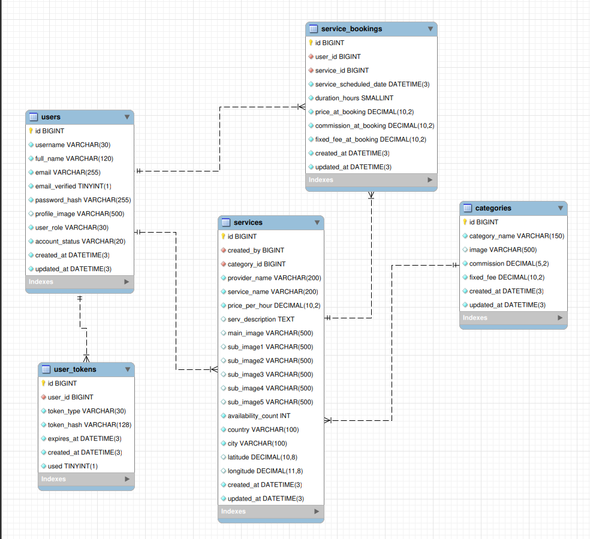

# Eventify Backend

This is the backend for the Eventify platform.  
It provides endpoints for managing users, services, bookings, analytics, and more in the feature !

---

## Features and overview

**-** **Authentication & Security**

- User registration with email verification (via secure link)
- Login using JSON Web Token (JWT)
- Password reset via email token system
- Secure token storage with expiration handling
- Email ownership verification before account activation
- Token management with expiration and usage tracking

**-** **Role-Based Access Control**

- Admin
- Client
- (Planned: Service Provider / Partner)

**-** **Email Notification System**

- Email verification on registration
- Password reset emails
- Booking confirmation emails:
  - Sent to the user
  - Sent to the service owner

**-** **Service Management**

- Admin can:
  Create, update, and delete services

**-** **Booking System**

- Users can:
  - Book services with date & duration
  - Receive booking summary via email
- System ensures:
  - No duplicate bookings (unique constraint)
  - Availability tracking

**-** **💰 Financial Snapshot**

- Booking stores:
  - price at booking
  - commission percentage at booking
  - fixed fee amount at booking

> This ensures:
> Historical accuracy even if prices or commissions change later

**-** **Booking Access Control**

- Users can:
  View only their bookings
  Search & filter bookings using query parameters
- Admin can:
  View all bookings in the system

**-** **Category Management**

- Admin can:
  Create and update categories
- And define:
  Commission percentage
  Fixed service fee for each category

**-** **Analytics & Statistics**

- Admin dashboard includes:
  - Total bookings per category
  - Revenue insights
  - Platform commission tracking

**-** **Smart Initialization**

- Automatic creation of default admin on first system run if there is not any user with admin role in database

---

## Database ERR diagram



---

## Requirements

- **Node.js**: v24 or higher
- **npm**: v10 or higher (comes with Node.js)
- **Database**: MySQL / MariaDB (configured in `.env`)
- **Sequelize** ORM
- **N8N** for email sender service

---

## ⚠️ This project was built as a learning experience and for eduction purpose only and It is not recommended to run in a production environment yet.

The structure and database design are not final and will be improved in future versions.

---

## Installation

1. **Clone the repository**

```bash
git clone https://github.com/sw-hx/eventify-backend.git
cd eventify-backend
```

2. **Install dependencies**

```bash
npm install
```

3. **Create database**

```bash
cd mysql_database/

mysql -u your_username -p
```

enter your password

```mysql
mysql> create database database_name;
mysql> use database_name;
mysql> source eventify_db_v1.sql;
mysql> exit
```

4. **Create a .env file in the root directory based on .env.example**

```env
# ===========================
# Backend Configuration
# ===========================

# Available port number in your system
PORT=3000

# Your server base URL
BASE_URL=http://your-server-domain:3000

# FontEnd endpoint
FRONTEND = http://your-frontend-domain:3000

# default admin information
DEFAULT_ADMIN_EMAIL=admin@yourapp.com
DEFAULT_ADMIN_PASSWORD=SuperSecure123!

# ===========================
# Database Configuration
# ===========================
DATABASE_HOST=localhost
DATABASE_USER=your_db_username
DATABASE_PASSWORD=your_db_password
DATABASE_NAME=your_database_name

# ===========================
# JWT Configuration
# ===========================
JWT_SECRET=your_jwt_secret_key

# ===========================
# N8N Webhook / Email Sender
# ===========================
# URL of N8N endpoint used for sending emails
N8N_WEBHOOK_EMAIL_SENDER=https://your-n8n-server/webhook/email
```

## Notes

- Make sure the N8N workflow is configured to handle incoming **POST requests** and send emails.

- The workflow should expect **email**, **subject**, and **message** fields in the request JSON.

The backend does not retry automatically on failure (handle retries in N8N)

# ⚠️ Security Notice

This backend currently uses JWT authentication via Authorization headers.

While this approach works for mobile applications (e.g., Android), it is not recommended for production web applications, as browsers may expose tokens to XSS attacks when stored in client-side storage.

so please do not use it for web app yet

## Running the Backend

```bash
npm run dev
```

## 📝 Issues & Contributions

If you encounter any problems, have questions, or want to contribute:

- Open an issue on this repository for bugs or feature requests.
- Fork the repository and submit a pull request for improvements.

> Your feedback is always welcome XD
